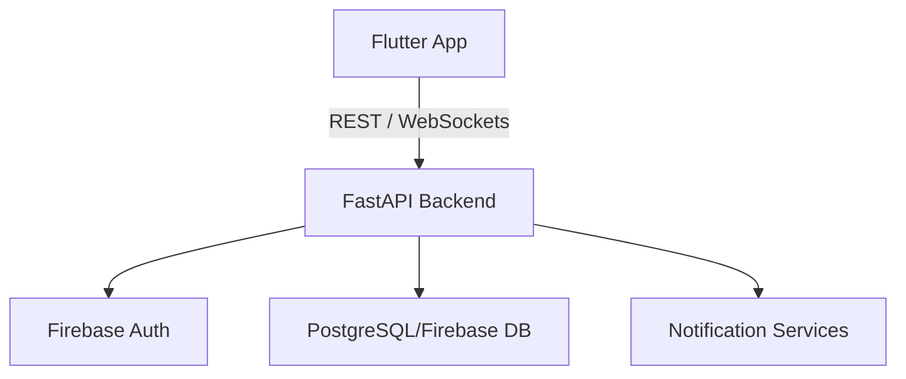
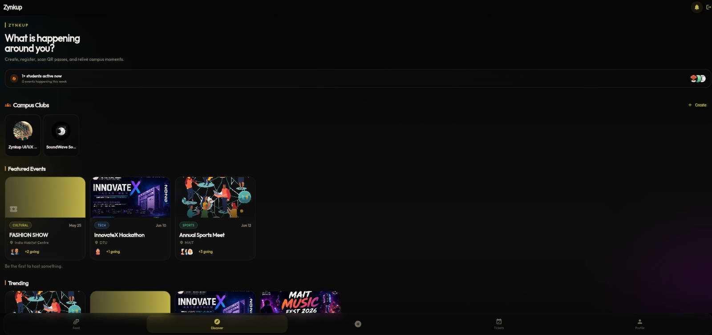
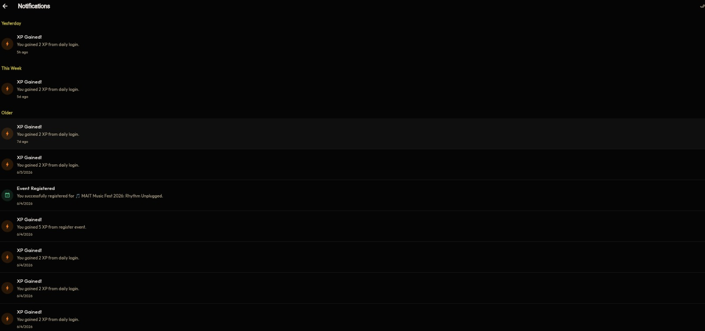
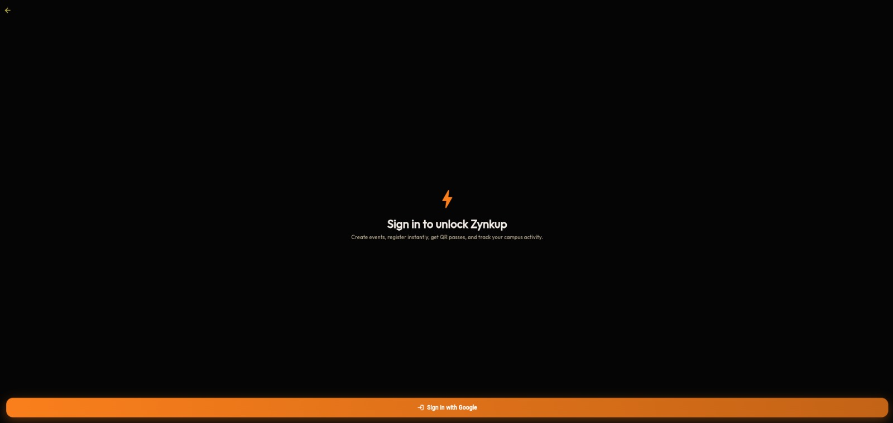

# ZynkUp 🎯

## Overview
ZynkUp is a smart networking and event management platform built using Flutter (Web/Mobile) and a FastAPI backend. It helps users connect, interact, manage events, and build communities efficiently through a modern, scalable, and real-time system.

## Architecture



## Features
- **🔐 Secure User Authentication** (JWT-based)
- **🧭 Event Management:** Create, register, and manage campus events with QR passes.
- **🤝 Campus Clubs:** Create clubs, join communities, and manage members with Role-based access (Admin/Member).
- **💬 Real-Time Club Chat:** Instantly chat with club members using WebSockets, featuring dynamic role badges and avatars.
- **🧑‍🤝‍🧑 Friend Connections:** Send, accept, and manage friend requests.
- **🏆 Gamified XP System:** Earn XP by engaging with the platform.
- **🖼️ Cloud Media:** Seamless image uploads and hosting powered by Cloudinary.
- **⚡ Fast & Scalable Backend:** Built on Python FastAPI with PostgreSQL (Supabase).
- **🪶 Clean, Responsive Flutter UI:** Beautiful, animated, glassmorphism UI that works on Web, Android, and iOS.

## Tech Stack
- **Frontend:** Flutter (Dart) - *Web & Mobile*
- **Backend:** FastAPI (Python)
- **Database:** PostgreSQL (Hosted on Supabase)
- **Real-Time:** WebSockets (FastAPI)
- **Storage:** Cloudinary API

## Screenshots

### Discover Page


### Tickets Page


### Feed Page


### Notifications Page


### Login Screen


### Club Page


### Profile Page


## Setup Guide

### 1️⃣ Clone the repository
```bash
git clone https://github.com/trghcj/zynkup-app.git
cd zynkup-app
```

### 2️⃣ Setup Backend & Database (Docker)
Ensure Docker Desktop is installed and running on your machine.
Rename `.env.example` to `.env.docker` and fill in any required keys (if not using defaults).

```bash
# This will spin up the FastAPI Backend and PostgreSQL Database instantly
docker-compose up -d --build
```
*Backend API will run locally at: `http://127.0.0.1:8000`*
*Database runs on `localhost:5432`*
### 3️⃣ Run Flutter App
```bash
cd ..
flutter pub get
flutter run -d chrome
```

## Folder Structure
```text
zynkup/
│
├── lib/                 # Flutter frontend source code
├── zynkup_backend/      # FastAPI backend source code
│   ├── app/             # Routers, models, and websocket logic
│   └── requirements.txt 
│
├── README.md
└── .gitignore
```

## Future Scope
- [ ] 🔔 Push notifications
- [ ] 🤖 AI-based networking recommendations
- [ ] 📅 Advanced calendar integrations

## 🤝 Contributing
Contributions are welcome! Feel free to fork this repo, create a feature branch, and submit a pull request.

## ⭐ Support
If you like this project, give it a star ⭐ on GitHub!
