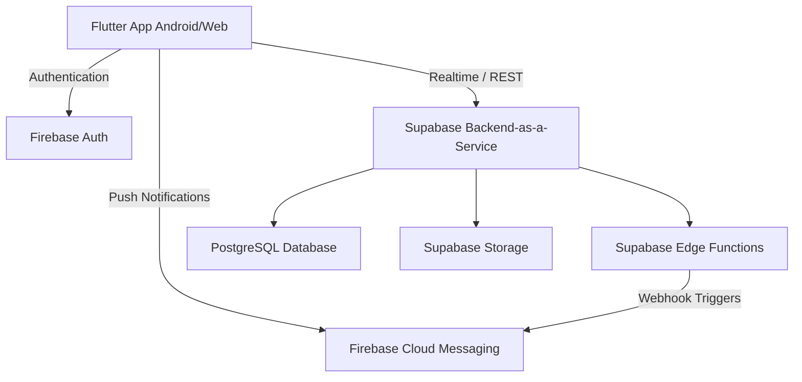

# ZynkUp 🎯

<p align="center">
  <a href="release/Zynkup.apk"></a>
  
  
  
</p>

---

> 📌 **Note:** Enable *Install from Unknown Sources* in Android settings before installing the APK.

---

**ZynkUp** is a mature, content-first campus social network and event management platform. Built with **Flutter** and powered by a robust **FastAPI & Supabase** backend, ZynkUp helps students connect, discover communities, and manage campus events seamlessly through a premium dark-themed interface.

## Architecture


```mermaid
graph TD
    A[Flutter App Android/Web] -->|Authentication| B[Firebase Auth]
    A -->|Push Notifications| C[Firebase Cloud Messaging]
    A -->|Realtime / REST| D[Supabase Backend-as-a-Service]
    D --> E[PostgreSQL Database]
    D --> F[Supabase Storage]
    D --> G[Supabase Edge Functions]
    G -->|Webhook Triggers| C
```

## Features
- **🎨 Content-First Dark UI:** A mature, refined, and responsive dark aesthetic (Linear/Spotify-inspired) with clean editorial typography and a minimalist Zynkup lime interaction system.
- **📅 Event Management:** Discover, host, and manage campus events with dynamic ticketing and QR-code passes.
- **🤝 Campus Communities:** Discover and found campus clubs, manage members with role-based access, and engage in club-specific events and chats.
- **💬 Social Campus Feed:** Share updates, photos, and polls directly to the campus timeline with real-time likes, replies, and reactions.
- **🔔 Automated Push Notifications:** Supabase Database Webhooks trigger Deno Edge Functions to fire targeted push notifications to users via Firebase Cloud Messaging.
- **🏆 Student Identity & Gamification:** Personalize your profile with an activity heatmap, inline statistics, customizable avatars, and a progression system (XP, Streaks, and Badges).
- **🔒 Secure Authentication:** Seamless login and session management powered by Firebase Auth.
- **☁️ Cloud Media:** Seamless image uploads and robust media hosting integrated with Supabase Storage.

## Tech Stack
- **Frontend:** Flutter (Dart)
- **Backend & Database:** Fastapi & Supabase (PostgreSQL)
- **Authentication:** Firebase Auth
- **Real-Time Data:** Supabase Realtime
- **Serverless Automation:** Supabase Edge Functions (Deno/TypeScript)
- **Push Notifications:** Firebase Cloud Messaging (FCM v1 API)

## Screenshots

<p align="center">
  
  
  
  
  
  
</p>

## Setup Guide

### 1️⃣ Clone the repository
```bash
git clone https://github.com/trghcj/zynkup-app.git
cd zynkup-app
```

### 2️⃣ Environment Configuration
Create a `.env` file in the root of the project and add your Supabase connection strings:
```env
SUPABASE_URL=your_supabase_project_url
SUPABASE_ANON_KEY=your_supabase_anon_key
```

### 3️⃣ Firebase Setup (Auth & Push Notifications)
Add your `google-services.json` file (downloaded from the Firebase Console) into the `android/app/` directory to enable Authentication and Cloud Messaging.

### 4️⃣ Run Flutter App
```bash
flutter pub get
flutter run
```

### 5️⃣ Build Compressed Split APKs (Android)
To drastically reduce the APK size by creating separate APKs for each CPU architecture, run the following command:
```bash
flutter build apk --split-per-abi
```
The compressed APKs will be output to `build/app/outputs/flutter-apk/`.

## Folder Structure
```text
zynkup-app/
│
├── lib/                 # Core Flutter frontend source code
│   ├── core/            # App routing, themes, and shared logic
│   ├── features/        # Feature-based modules (home, profile, auth, etc.)
│   └── main.dart        # Application entry point
│
├── assets/              # Local images, icons, and fonts
├── android/             # Android native code & Firebase config
├── .env                 # Environment variables (Supabase Keys)
└── README.md
```

## 🤝 Contributing
Contributions are welcome! Feel free to fork this repo, create a feature branch, and submit a pull request.

## ⭐ Support
If you like this project, give it a star ⭐ on GitHub!
