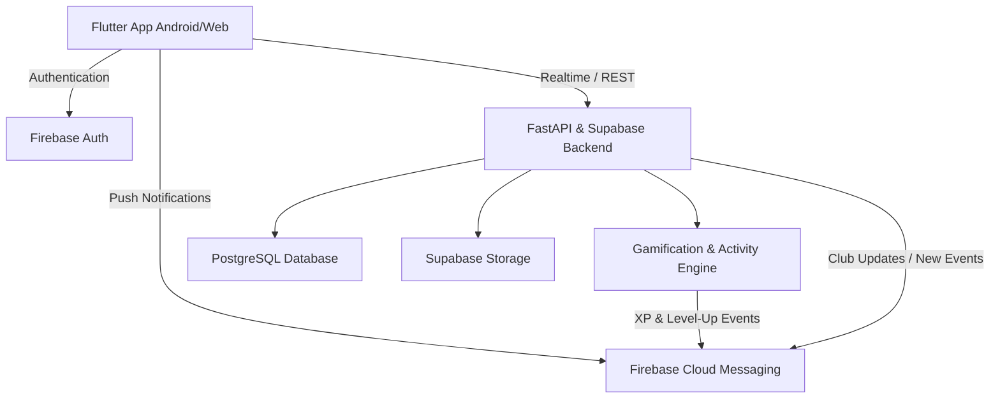

# ZynkUp 🎯

<p align="center">
  <a href="release/Zynkup.apk"></a>
  
  
  
</p>

### 📦 Split APK Downloads (Optimized Architecture)
| Architecture | Target Devices | Direct Download |
| :--- | :--- | :--- |
| **ARM64-v8a** *(Recommended)* | Modern Android Phones & Tablets | [Download ARM64 APK](release/zynkup-arm64-v8a-release.apk) |
| **ARMEABI-v7a** | Older 32-bit Android Devices | [Download ARMv7 APK](release/zynkup-armeabi-v7a-release.apk) |
| **x86_64** | Android Emulators & Chromebooks | [Download x86_64 APK](release/zynkup-x86_64-release.apk) |
| **Universal APK** | All Android Devices (Fat Binary) | [Download Universal APK](release/Zynkup.apk) |

---

> 📌 **Note:** Enable *Install from Unknown Sources* in Android settings before installing the APK.

---

**ZynkUp** is a mature, content-first campus social network and event management platform. Built with **Flutter** and powered by a robust **FastAPI & Supabase** backend, ZynkUp helps students connect, discover communities, follow student clubs, and manage campus events seamlessly through a responsive, light-green accented UI.

## Architecture


```mermaid
graph TD
    A[Flutter App Android/Web] -->|Authentication| B[Firebase Auth]
    A -->|Push Notifications| C[Firebase Cloud Messaging]
    A -->|Realtime / REST| D[FastAPI & Supabase Backend]
    D --> E[PostgreSQL Database]
    D --> F[Supabase Storage]
    D --> G[Gamification & Activity Engine]
    G -->|XP & Level-Up Events| C
    D -->|Club Updates / New Events| C
```

## Features
- **🎨 Content-First Adaptive UI:** A mature, refined, and responsive interface with clean editorial typography and a minimalist Zynkup light-green / lime interaction system in both dark and light modes.
- **🏰 "My Clubs" Dedicated Hub:** Centralized screen to view, manage, and filter all your student organizations across three tabs: **Created**, **Joined**, and **Following** with instant real-time search and category filtering (`Technical`, `Cultural`, `Sports`, `Academic`, `Social`, `General`).
- **🔔 Club Following & Instant Notifications:** Follow any campus club with a single tap. Followers immediately receive dual FCM push notifications and in-app Notification Center alerts whenever the club publishes a new event or feed post.
- **🔗 Embedded Social & Web Links:** Rich native preview cards in feed posts for YouTube (auto video thumbnails + play badge), Instagram (gradient badge cards), and interactive web links launched seamlessly via `url_launcher`.
- **🎖️ Custom Role Titles & Permission Tiers:** Club leadership can assign custom organizational titles (e.g., *Lead Designer*, *Tech Lead*, *Event Coordinator*, *Secretary*) to members while retaining backend security tiers (`Admin`, `Moderator`, `Member`).
- **✏️ Multi-Asset Post Editing & Safety Modals:** Complete post editing capability (update caption text, attached photos, and club banners) with confirmation prompts on post and event deletion.
- **🏆 Gamification & XP Rewards:** Real-time XP rewards across all key student actions (hosting events, founding clubs, joining communities, publishing feed posts, commenting, event check-ins, friend requests, and daily streaks) with automatic Level-Up progression.
- **📅 Event Management:** Discover, host, and manage campus events with dynamic ticketing, attendance tracking, and QR-code passes.
- **🤝 Campus Communities:** Discover and found campus clubs with role-based access, college affiliations (Delhi colleges directory), and club-specific chats.
- **💬 Social Campus Feed:** Share updates, photos, and polls directly to the campus feed with real-time likes, replies, and reactions.
- **📱 Profile Activity Timeline:** Chronological timeline tracking student milestones with clear distinction between founded clubs, joined clubs, hosted events, and feed posts.
- **🔒 Secure Authentication:** Seamless login and session management powered by Firebase Auth.
- **☁️ Cloud Media:** Seamless image uploads and robust media hosting integrated with Supabase Storage.

## Tech Stack
- **Frontend:** Flutter (Dart)
- **Backend & Database:** FastAPI & Supabase (PostgreSQL)
- **Authentication:** Firebase Auth
- **Real-Time Data:** Supabase Realtime
- **Serverless Automation:** Supabase Edge Functions (Deno/TypeScript)
- **Push Notifications:** Firebase Cloud Messaging (FCM v1 API)

## Screenshots

<p align="center">
  
  
  
  
  
  
</p>

## Setup Guide

### 1️⃣ Clone the repository
```bash
git clone https://github.com/trghcj/zynkup-app.git
cd zynkup-app
```

### 2️⃣ Environment Configuration
Create a `.env` file in the root of the project and add your Supabase connection strings:
```env
SUPABASE_URL=your_supabase_project_url
SUPABASE_ANON_KEY=your_supabase_anon_key
```

### 3️⃣ Firebase Setup (Auth & Push Notifications)
Add your `google-services.json` file (downloaded from the Firebase Console) into the `android/app/` directory to enable Authentication and Cloud Messaging.

### 4️⃣ Run Flutter App
```bash
flutter pub get
flutter run
```

### 5️⃣ Build Compressed Split APKs (Android)
To drastically reduce the APK size by creating separate APKs for each CPU architecture, run the following command:
```bash
flutter build apk --split-per-abi
```
The compressed APKs will be output to `build/app/outputs/flutter-apk/`.

## Folder Structure
```text
zynkup-app/
│
├── lib/                 # Core Flutter frontend source code
│   ├── core/            # App routing, themes, and shared logic
│   ├── features/        # Feature-based modules (clubs, feed, events, profile, auth, etc.)
│   └── main.dart        # Application entry point
│
├── assets/              # Local images, icons, and fonts
├── android/             # Android native code & Firebase config
├── zynkup_backend/      # FastAPI backend service & routes
├── .env                 # Environment variables (Supabase Keys)
└── README.md
```

## 🤝 Contributing
Contributions are welcome! Feel free to fork this repo, create a feature branch, and submit a pull request.

## ⭐ Support
If you like this project, give it a star ⭐ on GitHub!
