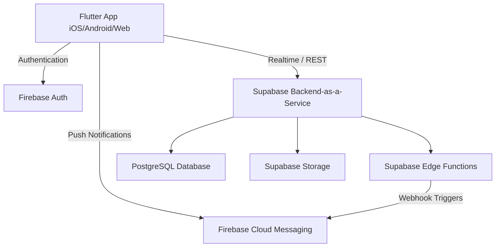
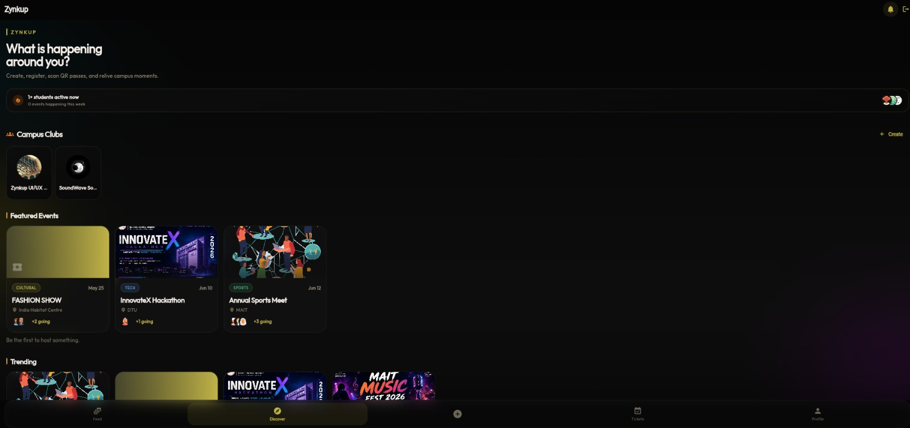
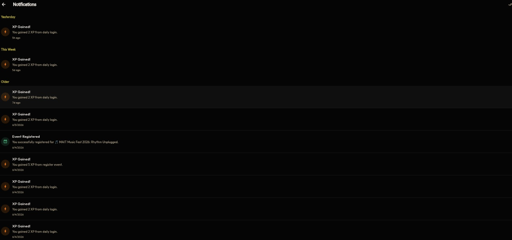
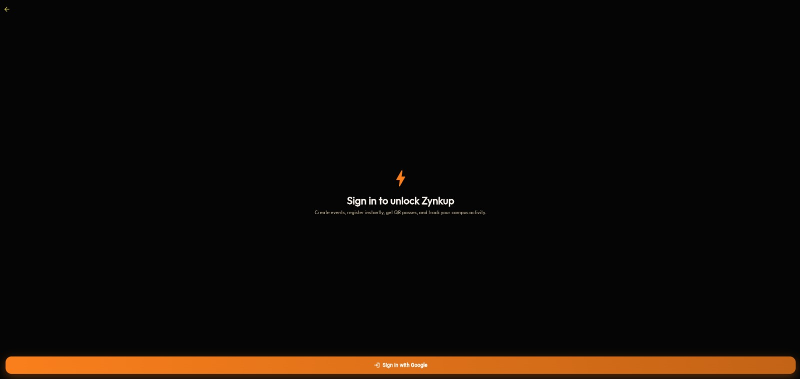

# ZynkUp 🎯

## Overview
ZynkUp is a smart networking and event management platform built using Flutter. It helps users connect, interact, manage events, and build communities efficiently through a modern, scalable, and real-time serverless architecture powered by Supabase and Firebase.

## Architecture


```mermaid
graph TD
    A[Flutter App iOS/Android/Web] -->|Authentication| B[Firebase Auth]
    A -->|Push Notifications| C[Firebase Cloud Messaging]
    A -->|Realtime / REST| D[Supabase Backend-as-a-Service]
    D --> E[PostgreSQL Database]
    D --> F[Supabase Storage]
    D --> G[Supabase Edge Functions]
    G -->|Webhook Triggers| C
```

## Features
- **🔐 Secure User Authentication:** Seamless login and session management natively handled by Firebase Auth.
- **🧭 Event Management:** Create, register, and manage campus events with QR passes and dynamic ticketing.
- **🤝 Campus Clubs:** Create clubs, join communities, and manage members with Role-based access (Admin/Member).
- **💬 Real-Time Interactions:** Instantly chat and see live updates (like/follower counts) powered by Supabase Realtime WebSockets.
- **🔔 Automated Push Notifications:** Supabase Database Webhooks instantly trigger Deno Edge Functions to fire targeted push notifications to users via Firebase Cloud Messaging.
- **🧑‍🤝‍🧑 Friend Connections:** Send, accept, and manage friend requests.
- **🏆 Gamified XP System:** Earn XP and level up by engaging with the platform.
- **🖼️ Cloud Media:** Seamless image uploads and hosting natively integrated with Supabase Storage buckets.
- **🪶 Premium Responsive UI:** Beautiful, animated, glassmorphism UI tailored for both Android and Web.

## Tech Stack
- **Frontend:** Flutter (Dart)
- **Backend & Database:** Supabase (PostgreSQL)
- **Authentication:** Firebase Auth
- **Real-Time Data:** Supabase Realtime
- **Serverless Automation:** Supabase Edge Functions (Deno/TypeScript)
- **Push Notifications:** Firebase Cloud Messaging (FCM v1 API)

## Screenshots

<p align="center">
  
  
  
  
  
  
</p>

## Setup Guide

### 1️⃣ Clone the repository
```bash
git clone https://github.com/trghcj/zynkup-app.git
cd zynkup-app
```

### 2️⃣ Environment Configuration
Create a `.env` file in the root of the project and add your Supabase connection strings:
```env
SUPABASE_URL=your_supabase_project_url
SUPABASE_ANON_KEY=your_supabase_anon_key
```

### 3️⃣ Firebase Setup (Auth & Push Notifications)
Add your `google-services.json` file (downloaded from the Firebase Console) into the `android/app/` directory to enable Authentication and Cloud Messaging.

### 4️⃣ Run Flutter App
```bash
flutter pub get
flutter run
```

## Folder Structure
```text
zynkup-app/
│
├── lib/                 # Core Flutter frontend source code
│   ├── core/            # App routing, themes, and shared logic
│   ├── features/        # Feature-based modules (home, profile, auth, etc.)
│   └── main.dart        # Application entry point
│
├── assets/              # Local images, icons, and fonts
├── android/             # Android native code & Firebase config
├── .env                 # Environment variables (Supabase Keys)
└── README.md
```

## 🤝 Contributing
Contributions are welcome! Feel free to fork this repo, create a feature branch, and submit a pull request.

## ⭐ Support
If you like this project, give it a star ⭐ on GitHub!
